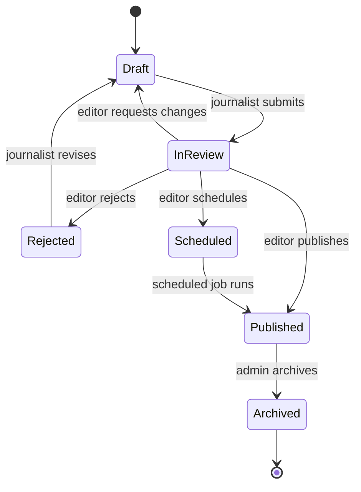
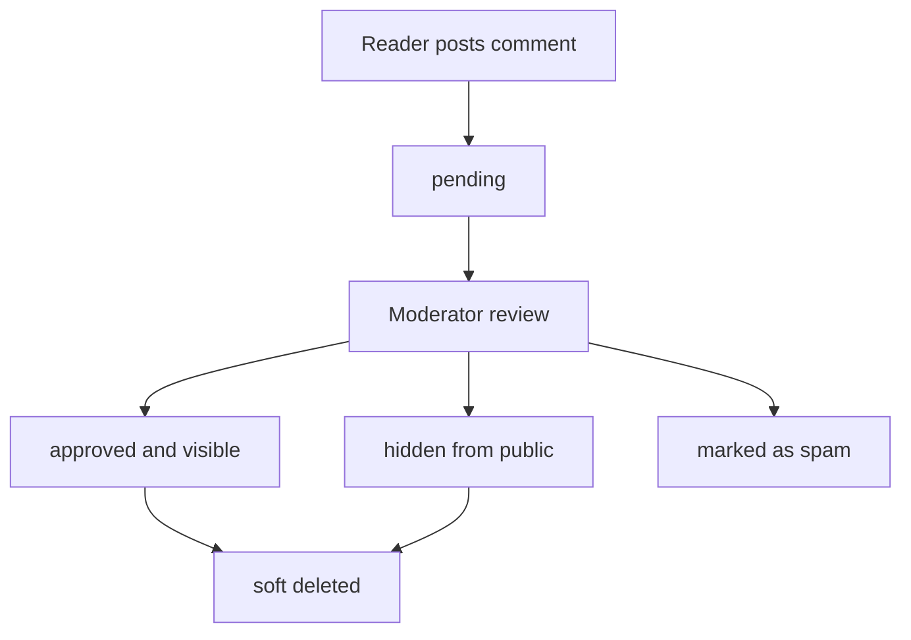
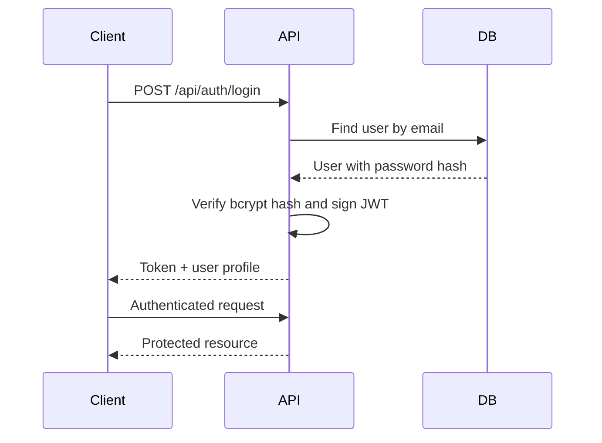
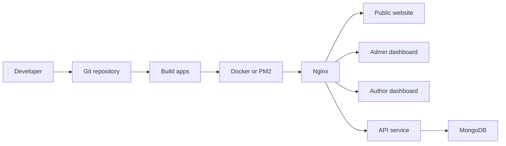

# Database Schema

The backend is expected to use MongoDB with Mongoose. These collections cover the core NewsPortal product.

## Users

```js
{
  name: String,
  email: { type: String, unique: true, index: true },
  passwordHash: String,
  role: { type: String, enum: ['subscriber', 'journalist', 'editor', 'moderator', 'admin', 'super_admin'] },
  avatarUrl: String,
  bio: String,
  social: { x: String, linkedin: String, website: String },
  isActive: Boolean,
  lastLoginAt: Date,
  createdAt: Date,
  updatedAt: Date
}
```

Indexes: unique `email`, plus `{ role: 1, isActive: 1 }`.

## Articles

```js
{
  title: String,
  slug: { type: String, unique: true, index: true },
  excerpt: String,
  content: String,
  status: { type: String, enum: ['draft', 'in_review', 'scheduled', 'published', 'rejected', 'archived'] },
  categoryId: ObjectId,
  tagIds: [ObjectId],
  authorId: ObjectId,
  editorId: ObjectId,
  featuredImage: { url: String, alt: String, publicId: String },
  seo: { title: String, description: String, canonicalUrl: String, noIndex: Boolean },
  metrics: { views: Number, shares: Number, readTimeMinutes: Number },
  scheduledAt: Date,
  publishedAt: Date,
  createdAt: Date,
  updatedAt: Date
}
```

Indexes: unique `slug`, text index on title/excerpt/content, `{ status: 1, publishedAt: -1 }`, `{ categoryId: 1, status: 1 }`.

## Categories

```js
{
  name: { type: String, unique: true },
  slug: { type: String, unique: true, index: true },
  description: String,
  parentId: ObjectId,
  order: Number,
  isVisible: Boolean,
  seo: { title: String, description: String },
  createdAt: Date,
  updatedAt: Date
}
```

## Tags

```js
{
  name: { type: String, unique: true },
  slug: { type: String, unique: true, index: true },
  description: String,
  createdAt: Date,
  updatedAt: Date
}
```

## Comments

```js
{
  articleId: ObjectId,
  userId: ObjectId,
  parentId: ObjectId,
  body: String,
  status: { type: String, enum: ['pending', 'approved', 'hidden', 'spam', 'deleted'] },
  moderationNote: String,
  moderatedBy: ObjectId,
  moderatedAt: Date,
  createdAt: Date,
  updatedAt: Date
}
```

Indexes: `{ articleId: 1, status: 1, createdAt: -1 }` and `{ status: 1, createdAt: -1 }`.

## Media

```js
{
  url: String,
  publicId: String,
  filename: String,
  mimeType: String,
  size: Number,
  width: Number,
  height: Number,
  alt: String,
  caption: String,
  uploadedBy: ObjectId,
  provider: { type: String, enum: ['local', 'cloudinary'] },
  createdAt: Date,
  updatedAt: Date
}
```

## Audit Logs

```js
{
  actorId: ObjectId,
  action: String,
  resourceType: String,
  resourceId: ObjectId,
  before: Object,
  after: Object,
  ipAddress: String,
  userAgent: String,
  createdAt: Date
}
```
*** Update File: docs/architecture/folder-structure.md
# Folder Structure

```text
news-portal/
  backend/
  client/
  docs/
  frontend/
    public-website/
    admin-dashboard/
    author-dashboard/
  infrastructure/
    docker/
    nginx/
    scripts/
  server/
  shared/
```

## `client`

Complete React + Vite public news portal frontend.

- `src/App.jsx`: app views, state, search, article page, dashboard preview.
- `src/data/news.js`: sample newsroom data.
- `src/App.css`: responsive UI styles.
- `src/index.css`: global reset.

## `frontend`

Contains three deployable apps:

- `public-website`: reader-facing website.
- `admin-dashboard`: administrator workspace.
- `author-dashboard`: journalist workspace.

Each app includes Vite config, HTML entry, React entry, routes, layouts, pages, components, and styles.

## `backend` and `server`

Backend workspace using Express, Mongoose, JWT, bcrypt, multer, Cloudinary, CORS, cookie-parser, and dotenv.

Recommended final backend layout:

```text
backend/src/
  config/
  controllers/
  middleware/
  models/
  routes/
  services/
  utils/
  validators/
```

## `shared`

Shared contracts and helpers:

- `constants`: roles, permissions, statuses, API endpoints.
- `validators`: payload validators.
- `types`: TypeScript-style resource contracts.
- `utils`: slugging, SEO, pagination, dates, images.

## `infrastructure`

Deployment support:

- `docker`: Dockerfiles and Compose files.
- `nginx`: reverse proxy and SSL snippets.
- `scripts`: start, stop, deploy, backup, restore.

## `docs`

- `api`: endpoint contracts.
- `architecture`: schema and system design.
- `deployment`: setup and release guides.
- `roles`: permission documentation.
*** Update File: docs/architecture/workflow-diagram.md
# Workflow Diagrams

## Article Publishing Workflow



## Comment Moderation Workflow



## Authentication Workflow



## Deployment Workflow



## Status Transition Table

| Current | Next | Actor |
| --- | --- | --- |
| `draft` | `in_review` | Journalist |
| `in_review` | `draft` | Editor |
| `in_review` | `rejected` | Editor |
| `in_review` | `scheduled` | Editor |
| `in_review` | `published` | Editor |
| `scheduled` | `published` | Scheduler/API |
| `published` | `archived` | Admin |
| `rejected` | `draft` | Journalist |
