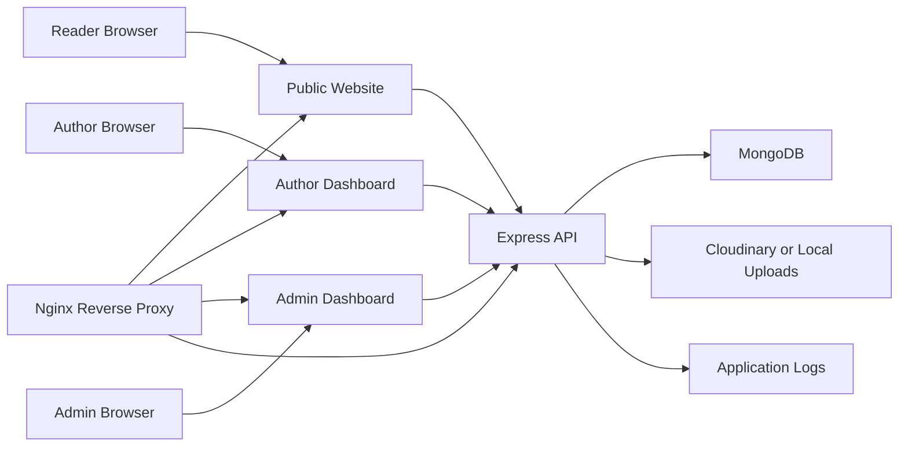
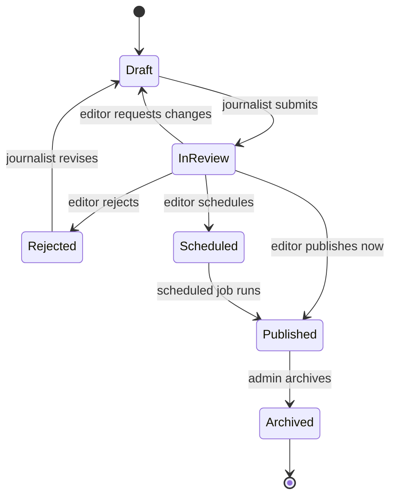
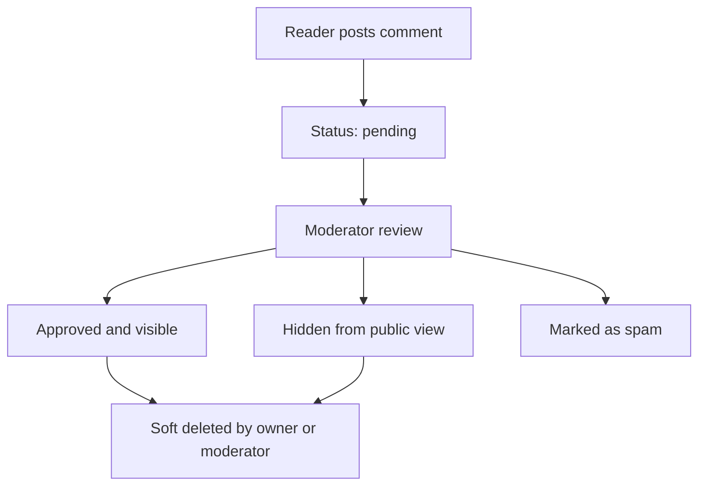
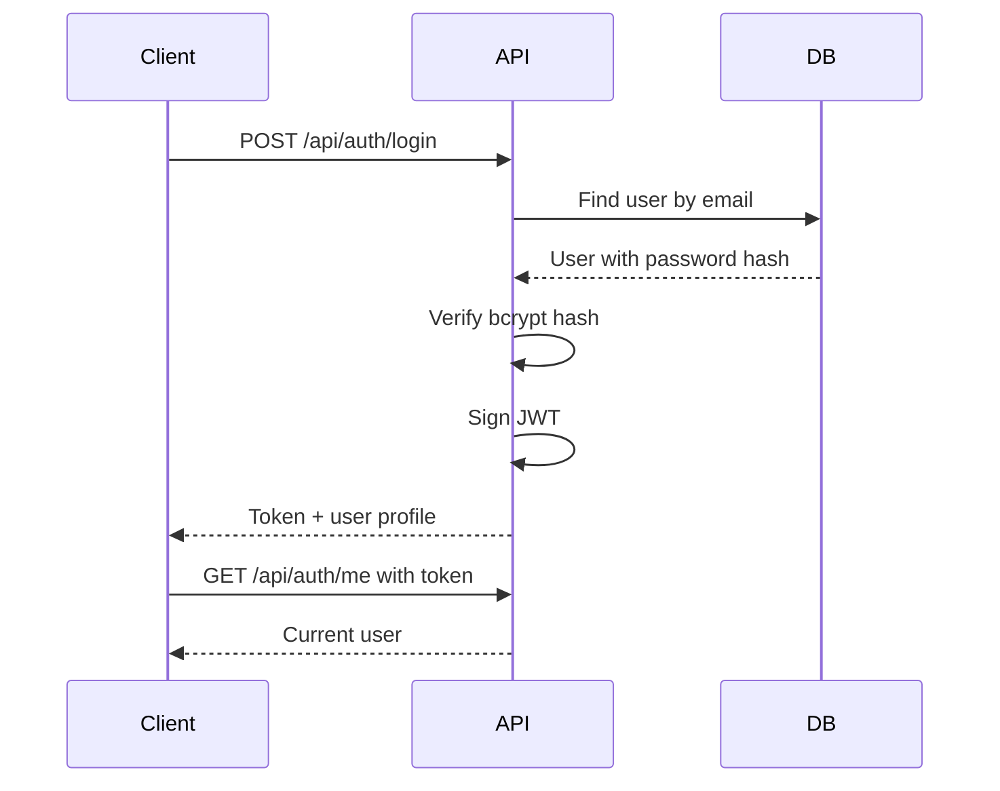
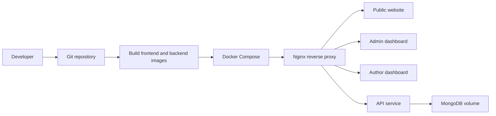
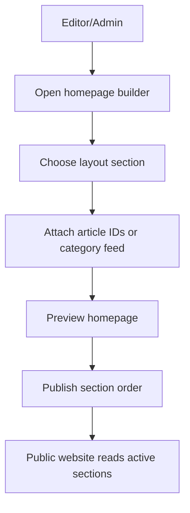

# System Design

NewsPortal is organized as a multi-frontend news publishing platform with a Node.js API, MongoDB persistence, shared validation utilities, and deployment infrastructure.

## Goals

- Serve a fast public news website.
- Provide separate admin and author dashboards.
- Support article drafting, review, scheduling, publishing, and archiving.
- Keep roles and permissions explicit.
- Store reusable data contracts in `shared`.
- Deploy through Docker and Nginx for production.

## High-Level Architecture



## Applications

| App | Folder | Purpose |
| --- | --- | --- |
| Public website | `frontend/public-website` and `client` | Reader-facing news experience. |
| Admin dashboard | `frontend/admin-dashboard` | Platform administration, content governance, SEO, ads, users. |
| Author dashboard | `frontend/author-dashboard` | Drafting, media uploads, analytics, comments for authors. |
| Backend API | `backend` / `server` | Express, JWT auth, MongoDB models, file upload handling. |
| Shared package | `shared` | Roles, permissions, validators, types, helpers. |
| Infrastructure | `infrastructure` | Docker, Nginx, scripts, deployment assets. |

## Backend Responsibilities

- Validate request payloads before database writes.
- Authenticate users with JWT and HTTP-only cookies.
- Authorize protected actions by role and resource ownership.
- Normalize slugs for articles, categories, and tags.
- Store article workflow status transitions.
- Upload and track media assets.
- Return consistent JSON envelopes.

## Frontend Responsibilities

- Render public content and dashboard workflows.
- Keep UI state responsive and optimistic only where safe.
- Call API endpoints through a small service layer.
- Protect dashboard routes by role.
- Display validation errors from the backend.
- Avoid exposing privileged fields in public views.

## Data Flow

1. A journalist creates a draft in the author dashboard.
2. The API validates the payload and saves an article with `status=draft`.
3. The journalist submits the article for review.
4. An editor reviews and changes status to `scheduled` or `published`.
5. The public website requests published articles only.
6. Readers comment on articles.
7. Moderators approve or hide pending comments.

## JSON Response Envelope

All API endpoints should use a predictable envelope:

```json
{
  "success": true,
  "message": "Optional status message",
  "data": {},
  "meta": {}
}
```

Errors:

```json
{
  "success": false,
  "message": "Validation failed",
  "errors": [
    { "field": "title", "message": "Title is required" }
  ]
}
```

## Security Notes

- Store password hashes with bcrypt.
- Keep JWT secrets out of source control.
- Use role checks and ownership checks on every protected mutation.
- Use HTTP-only cookies in production.
- Configure CORS to allow only the public, admin, and author frontend URLs.
- Validate uploaded file type and size before persistence.
*** Update File: docs/architecture/folder-structure.md
# Folder Structure

This project is organized as a full-stack news portal with separate frontend surfaces, backend services, shared utilities, deployment files, and documentation.

```text
news-portal/
  backend/
    .env.example
    node_modules/
  client/
    index.html
    package.json
    src/
      App.jsx
      App.css
      data/
        news.js
  docs/
    api/
    architecture/
    deployment/
    roles/
  frontend/
    public-website/
    admin-dashboard/
    author-dashboard/
  infrastructure/
    docker/
    nginx/
    scripts/
  server/
    package.json
    logs/
    uploads/
  shared/
    constants/
    types/
    utils/
    validators/
```

## `client`

The `client` folder contains a complete React + Vite public news portal frontend. It can be used as the main reader-facing app or as a reference implementation for `frontend/public-website`.

Important files:

- `src/App.jsx`: UI, view switching, comments, search, dashboard preview.
- `src/data/news.js`: sample article and dashboard data.
- `src/App.css`: responsive application styling.
- `src/index.css`: global reset and base styles.

## `frontend`

The `frontend` folder contains three deployable React apps:

- `public-website`: reader-facing website.
- `admin-dashboard`: administration workspace.
- `author-dashboard`: author workflow workspace.

Each app has its own `package.json`, `index.html`, `vite.config.js`, `src/main.jsx`, and `src/App.jsx`.

## `backend` and `server`

The project currently contains both `backend` and `server` folders. Treat them as backend workspaces until the implementation is consolidated.

Recommended final structure:

```text
backend/
  src/
    config/
    controllers/
    middleware/
    models/
    routes/
    services/
    utils/
    validators/
  uploads/
  logs/
  package.json
```

Use `server/package.json` dependency choices as the current backend stack: Express, Mongoose, JWT, bcrypt, multer, Cloudinary, CORS, cookie-parser, and dotenv.

## `shared`

The `shared` folder is for reusable constants, validators, TypeScript-style types, and helper functions consumed by backend and frontend code.

Suggested ownership:

- `constants/roles.js`: role names.
- `constants/permissions.js`: permission matrix.
- `constants/articleStatus.js`: article workflow states.
- `constants/apiEndpoints.js`: route constants.
- `validators/`: payload validation helpers.
- `utils/`: slugging, pagination, dates, images, SEO.

## `infrastructure`

Contains deployment support:

- `docker/`: Dockerfiles and Compose files.
- `nginx/`: reverse proxy and SSL snippets.
- `scripts/`: start, stop, deploy, backup, and restore scripts.

## `docs`

Documentation is split by concern:

- `api`: endpoint contracts and request/response examples.
- `architecture`: system structure, database schema, workflows.
- `deployment`: local, Docker, Nginx, SSL, production setup.
- `roles`: user responsibilities and permissions.
*** Update File: docs/architecture/database-schema.md
# Database Schema

The backend is expected to use MongoDB with Mongoose. The schema below defines the core collections for a production-ready news portal.

## Users

```js
{
  name: String,
  email: { type: String, unique: true, index: true },
  passwordHash: String,
  role: {
    type: String,
    enum: ['subscriber', 'journalist', 'editor', 'moderator', 'admin', 'super_admin']
  },
  avatarUrl: String,
  bio: String,
  social: {
    x: String,
    linkedin: String,
    website: String
  },
  isActive: Boolean,
  lastLoginAt: Date,
  createdAt: Date,
  updatedAt: Date
}
```

Indexes:

- Unique index on `email`.
- Compound index on `{ role: 1, isActive: 1 }`.

## Articles

```js
{
  title: String,
  slug: { type: String, unique: true, index: true },
  excerpt: String,
  content: String,
  status: {
    type: String,
    enum: ['draft', 'in_review', 'scheduled', 'published', 'rejected', 'archived']
  },
  categoryId: ObjectId,
  tagIds: [ObjectId],
  authorId: ObjectId,
  editorId: ObjectId,
  featuredImage: {
    url: String,
    alt: String,
    publicId: String
  },
  seo: {
    title: String,
    description: String,
    canonicalUrl: String,
    noIndex: Boolean
  },
  metrics: {
    views: Number,
    shares: Number,
    readTimeMinutes: Number
  },
  scheduledAt: Date,
  publishedAt: Date,
  createdAt: Date,
  updatedAt: Date
}
```

Indexes:

- Unique index on `slug`.
- Text index on `title`, `excerpt`, and `content`.
- Compound index on `{ status: 1, publishedAt: -1 }`.
- Compound index on `{ categoryId: 1, status: 1, publishedAt: -1 }`.
- Compound index on `{ authorId: 1, status: 1 }`.

## Categories

```js
{
  name: { type: String, unique: true },
  slug: { type: String, unique: true, index: true },
  description: String,
  parentId: ObjectId,
  order: Number,
  isVisible: Boolean,
  seo: {
    title: String,
    description: String
  },
  createdAt: Date,
  updatedAt: Date
}
```

## Tags

```js
{
  name: { type: String, unique: true },
  slug: { type: String, unique: true, index: true },
  description: String,
  createdAt: Date,
  updatedAt: Date
}
```

## Comments

```js
{
  articleId: ObjectId,
  userId: ObjectId,
  parentId: ObjectId,
  body: String,
  status: {
    type: String,
    enum: ['pending', 'approved', 'hidden', 'spam', 'deleted']
  },
  moderationNote: String,
  moderatedBy: ObjectId,
  moderatedAt: Date,
  createdAt: Date,
  updatedAt: Date
}
```

Indexes:

- Compound index on `{ articleId: 1, status: 1, createdAt: -1 }`.
- Compound index on `{ status: 1, createdAt: -1 }` for moderation queues.

## Media

```js
{
  url: String,
  publicId: String,
  filename: String,
  mimeType: String,
  size: Number,
  width: Number,
  height: Number,
  alt: String,
  caption: String,
  uploadedBy: ObjectId,
  provider: { type: String, enum: ['local', 'cloudinary'] },
  createdAt: Date,
  updatedAt: Date
}
```

## Advertisements

```js
{
  name: String,
  placement: String,
  type: { type: String, enum: ['image', 'html', 'script'] },
  targetUrl: String,
  imageUrl: String,
  html: String,
  isActive: Boolean,
  startsAt: Date,
  endsAt: Date,
  createdAt: Date,
  updatedAt: Date
}
```

## Homepage Sections

```js
{
  key: String,
  title: String,
  layout: String,
  articleIds: [ObjectId],
  categoryId: ObjectId,
  order: Number,
  isVisible: Boolean,
  createdAt: Date,
  updatedAt: Date
}
```

## Audit Logs

```js
{
  actorId: ObjectId,
  action: String,
  resourceType: String,
  resourceId: ObjectId,
  before: Object,
  after: Object,
  ipAddress: String,
  userAgent: String,
  createdAt: Date
}
```

Audit logs are recommended for role changes, article publishing, deletions, moderation decisions, and settings updates.
*** Update File: docs/architecture/workflow-diagram.md
# Workflow Diagrams

These diagrams describe the expected content, moderation, authentication, and deployment workflows.

## Article Publishing Workflow



## Comment Moderation Workflow



## Authentication Workflow



## Deployment Workflow



## Homepage Curation Workflow



## Recommended Status Transitions

| Current Status | Allowed Next Status | Actor |
| --- | --- | --- |
| `draft` | `in_review` | Journalist |
| `in_review` | `draft` | Editor |
| `in_review` | `rejected` | Editor |
| `in_review` | `scheduled` | Editor |
| `in_review` | `published` | Editor |
| `scheduled` | `published` | Scheduler/API |
| `published` | `archived` | Admin |
| `rejected` | `draft` | Journalist |
