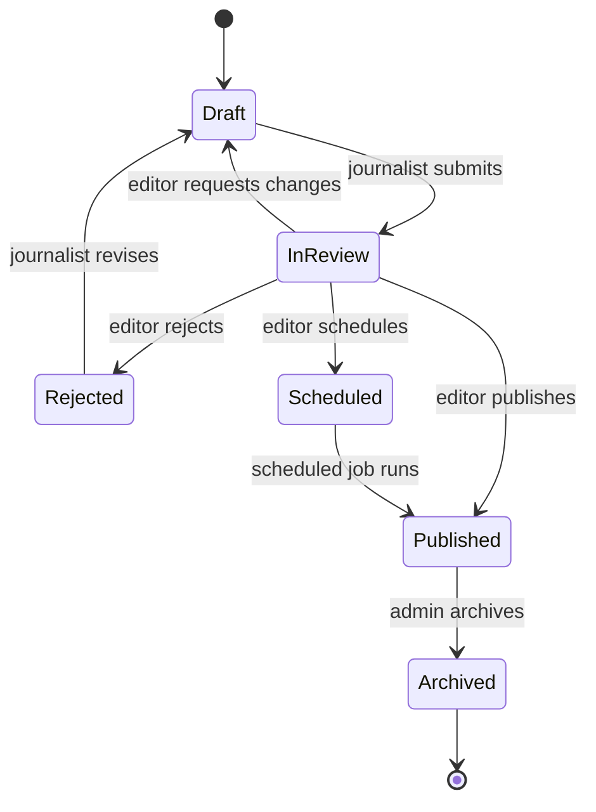
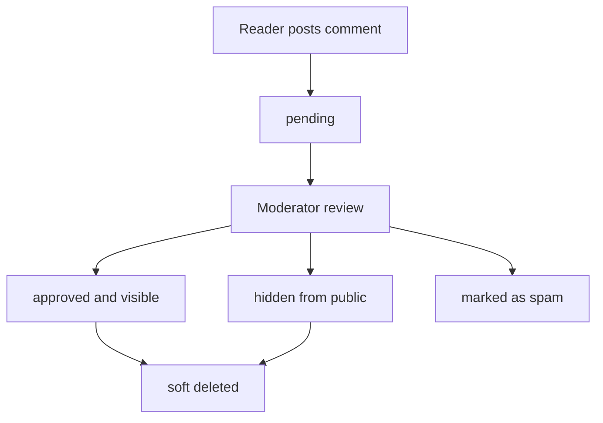
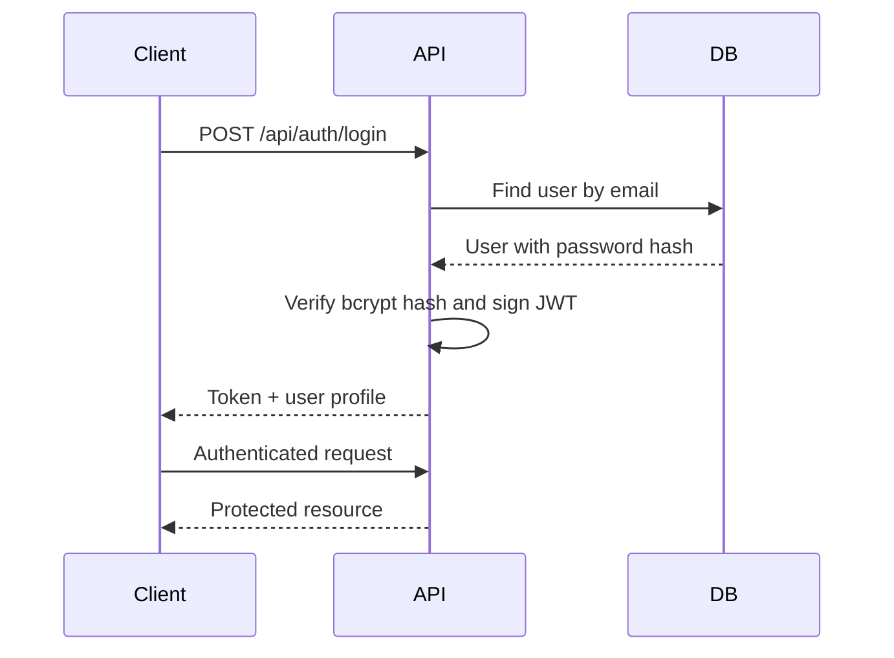
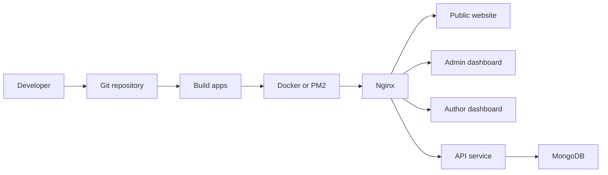

# Workflow Diagrams

## Article Publishing Workflow

## Comment Moderation Workflow

## Authentication Workflow

## Deployment Workflow

## Status Transition Table

| Current | Next | Actor |
| --- | --- | --- |
| `draft` | `in_review` | Journalist |
| `in_review` | `draft` | Editor |
| `in_review` | `rejected` | Editor |
| `in_review` | `scheduled` | Editor |
| `in_review` | `published` | Editor |
| `scheduled` | `published` | Scheduler/API |
| `published` | `archived` | Admin |
| `rejected` | `draft` | Journalist |
