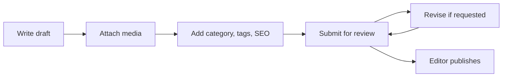

# Admin Role

Admins manage the operational side of the news portal. They can configure users, sections, media, ads, SEO, homepage modules, and moderation settings.

## Primary Responsibilities

- Manage staff accounts and subscriber accounts.
- Assign roles within allowed authority.
- Create, edit, reorder, hide, and delete categories.
- Create and merge tags.
- Manage media uploads and metadata.
- Configure homepage sections.
- Manage advertisements and placements.
- Configure SEO defaults and sitemap settings.
- Review analytics and operational health.

## Permissions

Admins can:

- Read all dashboard data.
- Create, update, suspend, and reactivate users.
- Create staff accounts below admin level.
- Publish, archive, or restore articles when needed.
- Moderate comments.
- Manage media library records.
- Manage platform settings.

Admins should not:

- Delete audit logs.
- Change super admin accounts unless they are also super admins.
- Bypass editorial review except for emergency corrections.

## Dashboard Views

- Dashboard overview.
- Articles.
- Categories.
- Tags.
- Authors.
- Users.
- Media Library.
- Homepage Builder.
- Advertisements.
- Analytics.
- SEO Settings.
- System Settings.

## Recommended Controls

- Require strong passwords.
- Revoke sessions when user roles change.
- Log role changes and destructive actions.
- Confirm before archiving published content.
- Use soft deletion for content where legally and operationally appropriate.
*** Update File: docs/roles/editor.md
# Editor Role

Editors own the quality and publication workflow for newsroom content.

## Primary Responsibilities

- Review submitted drafts.
- Request revisions from journalists.
- Edit headlines, excerpts, body copy, SEO metadata, tags, and categories.
- Schedule approved stories.
- Publish urgent stories.
- Reject unsuitable submissions with clear notes.
- Curate featured stories and homepage placements.

## Permissions

Editors can:

- View all articles.
- Update article content and metadata.
- Move articles between `in_review`, `draft`, `rejected`, `scheduled`, and `published`.
- Manage tags.
- View author performance analytics.
- Feature or unfeature articles.

Editors cannot:

- Manage admin users.
- Change system settings.
- Delete users.
- Permanently delete published content.

## Article Review Checklist

- Headline is accurate and not misleading.
- Excerpt summarizes the story clearly.
- Category and tags are correct.
- Featured image has useful alt text.
- Quotes and claims are attributed.
- SEO title and description are present.
- Article status transition is appropriate.

## Status Actions

| Action | Result |
| --- | --- |
| Request changes | `in_review` to `draft` |
| Reject | `in_review` to `rejected` |
| Schedule | `in_review` to `scheduled` |
| Publish | `in_review` or `scheduled` to `published` |
| Archive | Escalate to admin |
*** Update File: docs/roles/journalist.md
# Journalist Role

Journalists create and manage their own stories from draft through review.

## Primary Responsibilities

- Create article drafts.
- Upload or attach approved media.
- Add categories, tags, excerpts, and SEO suggestions.
- Submit completed drafts for editor review.
- Revise stories based on editor feedback.
- Track personal article performance.
- Respond to approved reader engagement where appropriate.

## Permissions

Journalists can:

- Create articles.
- Edit their own `draft` and `rejected` articles.
- Submit drafts for review.
- View their own article analytics.
- Upload media if enabled.
- View comments on their own published articles.

Journalists cannot:

- Publish directly unless granted an elevated editor role.
- Edit another author's article.
- Manage users.
- Moderate sitewide comments.
- Change categories, tags, ads, SEO defaults, or homepage structure.

## Draft Checklist

- Title is clear and specific.
- Excerpt gives readers useful context.
- Body includes verified facts and attribution.
- Images include alt text and captions where needed.
- Category and tags are relevant.
- SEO title and description are suggested.
- Draft is submitted to review only when ready.

## Workflow


*** Update File: docs/roles/moderator.md
# Moderator Role

Moderators protect discussion quality by reviewing comments, handling reports, and enforcing community standards.

## Primary Responsibilities

- Review pending comments.
- Approve constructive reader discussion.
- Hide abusive, spammy, or off-topic comments.
- Soft-delete comments when required.
- Escalate legal, safety, or newsroom-sensitive issues to admins or editors.
- Maintain moderation notes for accountability.

## Permissions

Moderators can:

- View comment moderation queues.
- Approve comments.
- Hide comments.
- Mark comments as spam.
- Soft-delete comments.
- View user comment history.

Moderators cannot:

- Edit article content.
- Publish articles.
- Manage users beyond moderation-related restrictions.
- Change site settings.
- Permanently delete audit records.

## Moderation Statuses

| Status | Meaning |
| --- | --- |
| `pending` | Awaiting review. |
| `approved` | Visible publicly. |
| `hidden` | Not visible but retained. |
| `spam` | Classified as spam or abuse. |
| `deleted` | Soft deleted by owner or moderator. |

## Review Guidelines

- Approve comments that are relevant and civil.
- Hide personal attacks, hate speech, threats, spam, and private personal information.
- Escalate credible threats immediately.
- Keep moderation notes short and factual.
- Do not alter a user's meaning when editing is supported; prefer hide/delete actions.
*** Update File: docs/roles/subscriber.md
# Subscriber Role

Subscribers are registered readers. They can personalize their account, comment on articles, and optionally access subscriber-only content if that feature is enabled.

## Primary Responsibilities

- Maintain their own account details.
- Follow community guidelines in comments.
- Report content or comments that violate policy.
- Manage newsletter or notification preferences when available.

## Permissions

Subscribers can:

- Read public articles.
- Create and manage their own comments.
- Edit their own profile.
- Save or bookmark articles if the feature is enabled.
- Subscribe to newsletters if the feature is enabled.

Subscribers cannot:

- Access dashboards.
- Create or edit articles.
- Moderate comments.
- Manage categories, tags, users, ads, or settings.

## Account Fields

```json
{
  "name": "Aarav Sharma",
  "email": "aarav@example.com",
  "role": "subscriber",
  "avatarUrl": "https://cdn.example.com/avatar.jpg",
  "preferences": {
    "newsletter": true,
    "topics": ["Politics", "Technology"]
  }
}
```

## Comment Rules

- Comments may require moderation before appearing publicly.
- Users can edit or delete their own comments within the configured policy.
- Repeated abuse may lead to suspension.
- Deleted comments should be soft-deleted to preserve thread context.
