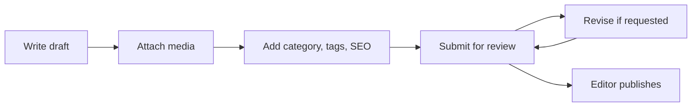

# Journalist Role

Journalists create and manage their own stories from draft through review.

## Responsibilities

- Create article drafts.
- Upload or attach approved media.
- Add categories, tags, excerpts, and SEO suggestions.
- Submit completed drafts for editor review.
- Revise stories based on editor feedback.
- Track personal article performance.

## Permissions

Journalists can:

- Create articles.
- Edit their own `draft` and `rejected` articles.
- Submit drafts for review.
- View their own analytics.
- Upload media if enabled.
- View comments on their own published articles.

Journalists cannot:

- Publish directly unless granted editor permissions.
- Edit another author's article.
- Manage users.
- Moderate sitewide comments.
- Change categories, tags, ads, SEO defaults, or homepage structure.

## Draft Checklist

- Title is clear and specific.
- Excerpt gives readers useful context.
- Body includes verified facts and attribution.
- Images include alt text and captions where needed.
- Category and tags are relevant.
- Draft is submitted only when ready.

## Workflow

